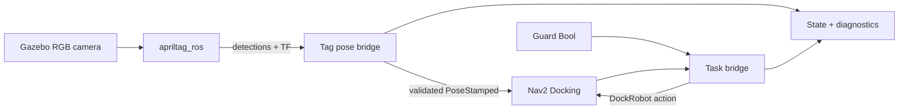
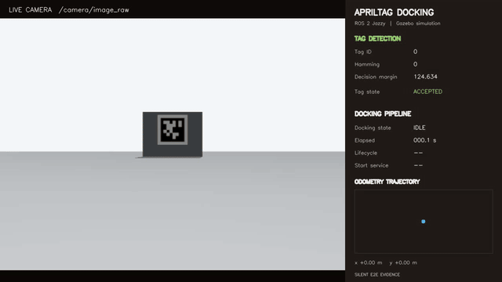

# ROS 2 AprilTag Docking Demo

[](https://github.com/Quchaosheng/ros2-apriltag-docking-demo/actions/workflows/ros2-ci.yml)

A Gazebo demo that drives a TurtleBot3 to a charging-dock staging pose, validates a live AprilTag detection, and completes the final approach with the Nav2 Docking Framework.

## Architecture



The project reuses `opennav_docking::SimpleChargingDock`. Custom code is limited to:

- Tag ID to dock type mapping.
- Low-confidence, unknown, and multiple-Tag rejection.
- Three-frame confirmation, publication rate limiting, Tag loss, and pose-jump rejection.
- Guard, DockRobot Action, and diagnostic integration.

## Demo Video



[Download the full 50-second MP4](docs/demo/apriltag_docking_demo.mp4)

The recording shows a live Gazebo camera feed, AprilTag validation, Nav2 staging, visual recovery, and a successful docking result.

## Platform

- Ubuntu 24.04
- ROS 2 Jazzy
- Gazebo Harmonic through `ros_gz`
- TurtleBot3 Waffle Pi

The code has compatibility imports for ROS 2 Humble unit testing, but the complete simulation targets Jazzy.

## Install

```bash
sudo apt update
sudo apt install -y \
  ros-jazzy-desktop \
  ros-jazzy-navigation2 \
  ros-jazzy-nav2-bringup \
  ros-jazzy-opennav-docking \
  ros-jazzy-apriltag-ros \
  ros-jazzy-apriltag-msgs \
  ros-jazzy-ros-gz-sim \
  ros-jazzy-ros-gz-image \
  ros-jazzy-turtlebot3-gazebo \
  ros-jazzy-turtlebot3-navigation2

mkdir -p ~/demo2_ws/src
cd ~/demo2_ws/src
git clone https://github.com/Quchaosheng/ros2-apriltag-docking-demo.git
cd ..
source /opt/ros/jazzy/setup.bash
rosdep install --from-paths src --ignore-src -r -y
colcon build --symlink-install
source install/setup.bash
```

## Run

```bash
ros2 launch demo2_apriltag_docking demo.launch.py
```

Start docking after Nav2 is active and the Tag is visible:

```bash
ros2 service call /demo2/start_docking std_srvs/srv/Trigger "{}"
```

Cancel the active request:

```bash
ros2 service call /demo2/cancel_docking std_srvs/srv/Trigger "{}"
```

Run without Gazebo or RViz windows:

```bash
ros2 launch demo2_apriltag_docking demo.launch.py headless:=true rviz:=false
```

## Guard Integration

The standalone demo uses `guard_required:=false`. To require a Guard heartbeat:

```bash
ros2 launch demo2_apriltag_docking demo.launch.py guard_required:=true
```

Allow docking with a transient-local message:

```bash
ros2 topic pub --once --qos-durability transient_local \
  /guard/docking_allowed std_msgs/msg/Bool "{data: true}"
```

A false, missing, or stale Guard prevents a new request. A false Guard during an active request cancels the DockRobot goal.

## Monitor

```bash
ros2 topic echo /demo2/tag_state
ros2 topic echo /demo2/docking_state
ros2 topic echo /diagnostics
```

Expected successful task states:

```text
NAV_TO_STAGING
INITIAL_PERCEPTION
CONTROLLING
WAIT_FOR_CHARGE
SUCCEEDED
```

Tag states include `NO_TAG`, `UNKNOWN_TAG`, `LOW_MARGIN`, `HAMMING`, `MULTI_TAG`, `CONFIRMING`, `POSE_JUMP`, `TAG_LOST`, `TF_UNAVAILABLE`, and `ACCEPTED`.

## Rejection And Recovery

| Scenario | Expected behavior |
| --- | --- |
| Decision margin below 50 | Reject with `LOW_MARGIN` |
| Hamming distance above 0 | Reject with `HAMMING` |
| Unmapped Tag ID | Reject with `UNKNOWN_TAG` |
| More than one visible Tag | Reject the frame with `MULTI_TAG` |
| Translation jump above 0.25 m | Reject and restart three-frame confirmation |
| Yaw jump above 20 degrees | Reject and restart three-frame confirmation |
| No accepted sample for 0.5 s | Report `TAG_LOST`; Nav2 handles stale-pose timeout and retry |
| Docking exceeds Nav2 timeout | Relay the DockRobot error and retry count |

Tune thresholds in [`config/nav2_docking.yaml`](src/demo2_apriltag_docking/config/nav2_docking.yaml). Change Tag-to-dock mapping in [`config/docks.yaml`](src/demo2_apriltag_docking/config/docks.yaml).

## Test

```bash
source /opt/ros/jazzy/setup.bash
colcon build --symlink-install
colcon test --event-handlers console_direct+
colcon test-result --verbose
```

The automated suite covers mapping validation, confidence gates, debounce, duplicate suppression, pose jumps, Tag loss, Guard policy, action feedback mapping, configuration contracts, SDF assets, map metadata, and Launch syntax.

## Demo Scope

This repository simulates successful charging with Nav2's distance-based `SimpleChargingDock` behavior. It does not implement physical contacts, battery-current sensing, motor-stall detection, Jetson acceleration, or production safety certification.
