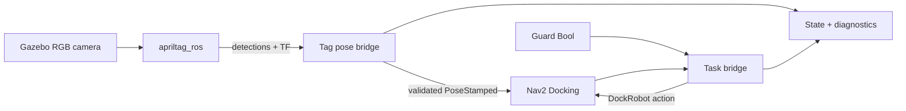
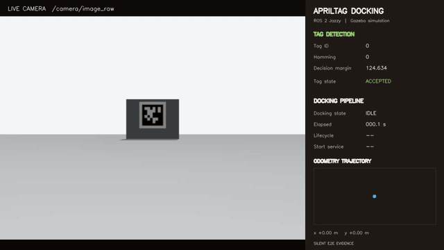

# ROS 2 AprilTag Docking Demo

**English** | [简体中文](README.zh-CN.md)

[](https://github.com/Quchaosheng/ros2-apriltag-docking-demo/actions/workflows/ros2-ci.yml)

A reproducible Gazebo docking workflow that guides a TurtleBot3 to a charging-dock staging pose,
validates live AprilTag observations, and delegates the final approach to the Nav2 Docking
Framework. The project configures and reuses `opennav_docking::SimpleChargingDock`; it does not
reimplement Nav2's final-approach controller.

## Architecture


```mermaid
flowchart LR
    Camera[Gazebo RGB camera] --> AprilTag[apriltag_ros]
    AprilTag -->|detections + TF| PoseBridge[Tag pose bridge]
    PoseBridge -->|validated PoseStamped| Docking[Nav2 Docking]
    TaskBridge[Task bridge] -->|DockRobot action| Docking
    Guard[Guard Bool] --> TaskBridge
    Docking --> TaskBridge
    PoseBridge --> Monitor[State + diagnostics]
    TaskBridge --> Monitor
```

The project reuses `opennav_docking::SimpleChargingDock`. Custom code is limited to:

- Tag ID to dock type mapping.
- Low-confidence and unknown-Tag rejection, plus explicit handling of ambiguous multi-Tag views.
- Three-frame confirmation, publication rate limiting, Tag loss, and pose-jump rejection.
- Guard, DockRobot Action, and diagnostic integration.

## Demo Video



[Download the full 50-second MP4](docs/demo/apriltag_docking_demo.mp4)

The recording shows a live Gazebo camera feed, AprilTag validation, Nav2 staging, visual recovery, and a successful docking result.

## Platform

- Ubuntu 24.04
- ROS 2 Jazzy
- Gazebo Harmonic through `ros_gz`
- TurtleBot3 Waffle Pi

The complete Gazebo/AprilTag/Nav2 simulation target is Ubuntu 24.04 + ROS 2 Jazzy + Gazebo
Harmonic. `headless:=true` hides only the GUI; camera simulation still requires a usable GPU or a
software-rendering backend. If the camera produces no output, AprilTag will appear as a continuous
`NO_TAG` state.

The repository targets a manual full-demo environment of ROS 2 Jazzy on Ubuntu
24.04. CI currently covers node-level and contract tests; it does not
release-qualify the complete Gazebo/AprilTag/Nav2 launch graph. Humble
compatibility imports do not imply that the full simulation is validated on
Ubuntu 22.04.

## Install

```bash
sudo apt update
sudo apt install -y \
  ros-jazzy-desktop \
  ros-jazzy-navigation2 \
  ros-jazzy-nav2-bringup \
  ros-jazzy-opennav-docking \
  ros-jazzy-apriltag-ros \
  ros-jazzy-apriltag-msgs \
  ros-jazzy-ros-gz-sim \
  ros-jazzy-ros-gz-image \
  ros-jazzy-turtlebot3-gazebo \
  ros-jazzy-turtlebot3-navigation2

mkdir -p ~/demo2_ws/src
cd ~/demo2_ws/src
git clone https://github.com/Quchaosheng/ros2-apriltag-docking-demo.git
cd ..
source /opt/ros/jazzy/setup.bash
rosdep install --from-paths src --ignore-src -r -y
colcon build --symlink-install
source install/setup.bash
```

## Run

```bash
ros2 launch demo2_apriltag_docking demo.launch.py
```

Start docking after Nav2 is active and the Tag is visible:

```bash
ros2 service call /demo2/start_docking std_srvs/srv/Trigger "{}"
```

Cancel the active request:

```bash
ros2 service call /demo2/cancel_docking std_srvs/srv/Trigger "{}"
```

Run without Gazebo or RViz windows:

```bash
ros2 launch demo2_apriltag_docking demo.launch.py headless:=true rviz:=false
```

`headless:=true` removes the Gazebo client window; it does not remove rendering requirements from
camera simulation. A machine without a usable GPU may need software rendering and can run more
slowly or fail because of local Gazebo/OGRE/driver configuration. Headless launch is therefore an
execution mode, not evidence that the complete simulation is GPU-independent.

## Guard Integration

The standalone demo uses `guard_required:=false`. To require a Guard heartbeat:

```bash
ros2 launch demo2_apriltag_docking demo.launch.py guard_required:=true
```

Allow docking with a transient-local message:

```bash
ros2 topic pub --once --qos-durability transient_local \
  /guard/docking_allowed std_msgs/msg/Bool "{data: true}"
```

A false, missing, or stale Guard prevents a new request. A false Guard during an active request cancels the DockRobot goal.

## Monitor

```bash
ros2 topic echo /demo2/tag_state
ros2 topic echo /demo2/docking_state
ros2 topic echo /diagnostics
```

Expected successful task states:

```text
NAV_TO_STAGING
INITIAL_PERCEPTION
CONTROLLING
WAIT_FOR_CHARGE
SUCCEEDED
```

Tag states include `NO_TAG`, `UNKNOWN_TAG`, `LOW_MARGIN`, `HAMMING`, `MULTI_TAG`, `CONFIRMING`, `POSE_JUMP`, `TAG_LOST`, `TF_UNAVAILABLE`, and `ACCEPTED`.

## Rejection And Recovery

| Scenario | Expected behavior |
| --- | --- |
| Decision margin below 50 | Reject with `LOW_MARGIN` |
| Hamming distance above 0 | Reject with `HAMMING` |
| Unmapped Tag ID | Reject with `UNKNOWN_TAG` |
| More than one visible Tag | Treat the observation as ambiguous and reject it with `MULTI_TAG` |
| Translation jump above 0.25 m | Reject and restart three-frame confirmation |
| Yaw jump above 20 degrees | Reject and restart three-frame confirmation |
| No accepted sample for 0.5 s | Report `TAG_LOST`; stop publishing an accepted observation and allow Nav2's configured stale-pose/retry behavior to take effect |
| Docking exceeds Nav2 timeout | Relay the DockRobot error and retry count |

Tune thresholds in [`config/nav2_docking.yaml`](src/demo2_apriltag_docking/config/nav2_docking.yaml). Change Tag-to-dock mapping in [`config/docks.yaml`](src/demo2_apriltag_docking/config/docks.yaml).

## Test

```bash
source /opt/ros/jazzy/setup.bash
colcon build --symlink-install
colcon test --event-handlers console_direct+
colcon test-result --verbose
```

The automated suite covers mapping validation, confidence gates, three-frame confirmation,
multi-Tag ambiguity, pose jumps, the 0.5 s Tag-loss transition, Guard policy, action feedback
mapping, configuration contracts, SDF assets, map metadata, and launch-file syntax.

There are currently no `launch_testing` integration tests that boot the complete Gazebo,
`apriltag_ros`, Nav2, and docking-action graph and assert an end-to-end result. The recorded demo and
manual run validate that workflow in the stated Jazzy/Ubuntu environment, while the automated suite
primarily protects node-level policy and configuration contracts. The recording is demonstration
evidence, not automated test evidence.

## Development Workflow

This project combines direct implementation, upstream component integration, and AI-assisted iteration. Runtime capabilities are evidenced only by source code, tests, CI, simulation, or explicitly labeled hardware evidence; plans and generated text are not runtime evidence. Public Git history remains unchanged.

## Demo Scope

This repository simulates successful charging with Nav2's distance-based `SimpleChargingDock` behavior. It does not implement physical contacts, battery-current sensing, motor-stall detection, Jetson acceleration, or production safety certification.

Gazebo camera output and AprilTag detection performance depend on scene lighting, resolution,
rendering backend, and available GPU or software-rendering capacity. The simulation demonstrates
integration behavior; it does not establish real-camera detection range, latency, false-positive
rate, or embedded-compute performance.
