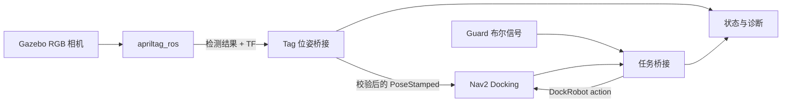

# ROS 2 AprilTag 对接演示

[English](README.md) | **简体中文**

[](https://github.com/Quchaosheng/ros2-apriltag-docking-demo/actions/workflows/ros2-ci.yml)
[](LICENSE)

这是一个基于 Gazebo 的可复现对接流程：TurtleBot3 先到达充电桩前的 staging
位姿，系统确认实时 AprilTag 观测后，再由 Nav2 Docking Framework 完成最终接近。

## 架构



项目复用 `opennav_docking::SimpleChargingDock`。自定义代码只负责：

- Tag ID 到 dock 类型的映射；
- 低置信度、未知 Tag 和多 Tag 拒绝；
- 三帧确认、发布限速、Tag 丢失和位姿跳变拒绝；
- Guard、DockRobot Action 和诊断集成。

## 演示视频


[下载完整的 50 秒 MP4](docs/demo/apriltag_docking_demo.mp4)

视频展示 Gazebo 实时相机画面、AprilTag 校验、Nav2 staging、视觉恢复和最终
成功对接。

## 平台

- Ubuntu 24.04
- ROS 2 Jazzy
- 通过 `ros_gz` 使用 Gazebo Harmonic
- TurtleBot3 Waffle Pi

完整的 Gazebo/AprilTag/Nav2 仿真目标是 Ubuntu 24.04 + ROS 2 Jazzy + Gazebo Harmonic。
`headless:=true` 会以 server-only 模式启动 Gazebo，并启用 `--headless-rendering`；
相机仿真仍需要可用 GPU 或软件渲染后端。如果相机没有输出，AprilTag 会持续表现为
`NO_TAG`。

CI 覆盖节点级与契约测试，并在 Ubuntu 24.04 + ROS 2 Jazzy 上运行一条完整的
Gazebo/AprilTag/Nav2 `launch_testing` 链路。由于托管 runner 的 EGL 可用性并不稳定，
CI 集成测试使用 Xvfb 提供显示渲染上下文。代码中的 ROS 2 Humble 兼容导入不表示
Ubuntu 22.04 的完整仿真已经验证。

姊妹仓库 `ros2-control-vcan-motor-demo` 目标是 Ubuntu 22.04 + ROS 2 Humble。
两个 Demo 应使用不同环境或容器，不要在同一个已经 source 的 shell 中混用
Humble 与 Jazzy 软件包。

## 安装

```bash
sudo apt update
sudo apt install -y \
  ros-jazzy-desktop ros-jazzy-navigation2 ros-jazzy-nav2-bringup \
  ros-jazzy-opennav-docking ros-jazzy-apriltag-ros ros-jazzy-apriltag-msgs \
  ros-jazzy-ros-gz-sim ros-jazzy-ros-gz-image \
  ros-jazzy-turtlebot3-gazebo ros-jazzy-turtlebot3-navigation2

mkdir -p ~/demo2_ws/src
cd ~/demo2_ws/src
git clone https://github.com/Quchaosheng/ros2-apriltag-docking-demo.git
cd ..
source /opt/ros/jazzy/setup.bash
rosdep install --from-paths src --ignore-src -r -y
colcon build --symlink-install
source install/setup.bash
```

## 运行

```bash
ros2 launch demo2_apriltag_docking demo.launch.py
```

Nav2 激活且能看到 Tag 后开始对接：

```bash
ros2 service call /demo2/start_docking std_srvs/srv/Trigger "{}"
```

取消当前请求：

```bash
ros2 service call /demo2/cancel_docking std_srvs/srv/Trigger "{}"
```

无 Gazebo 或 RViz 窗口运行：

```bash
ros2 launch demo2_apriltag_docking demo.launch.py headless:=true rviz:=false
```

`headless:=true` 会移除 Gazebo 客户端窗口，并启用 Gazebo 的离屏
`--headless-rendering` 路径，但不会消除相机仿真的渲染要求。没有可用 GPU 的机器可能需要
软件渲染，也可能因本地 Gazebo、OGRE 或驱动配置而运行较慢或失败。因此 headless 是执行模式，
不能证明完整仿真与 GPU 无关。

在装有 Xvfb 的机器上，可以改用显示上下文渲染，而不是 EGL：

```bash
xvfb-run -a ros2 launch demo2_apriltag_docking demo.launch.py \
  headless:=true headless_rendering:=false rviz:=false
```

## Guard 集成

独立演示默认使用 `guard_required:=false`。若要要求 Guard 心跳：

```bash
ros2 launch demo2_apriltag_docking demo.launch.py guard_required:=true
```

使用 transient-local 消息允许对接：

```bash
ros2 topic pub --once --qos-durability transient_local \
  /guard/docking_allowed std_msgs/msg/Bool "{data: true}"
```

Guard 为 false、缺失或过期时会阻止新请求；活动请求期间 Guard 变为 false，
会取消 DockRobot 目标。

## 监控

```bash
ros2 topic echo /demo2/tag_state
ros2 topic echo /demo2/docking_state
ros2 topic echo /diagnostics
```

成功任务状态依次可能为：

```text
NAV_TO_STAGING
INITIAL_PERCEPTION
CONTROLLING
WAIT_FOR_CHARGE
SUCCEEDED
```

Tag 状态包括 `NO_TAG`、`UNKNOWN_TAG`、`LOW_MARGIN`、`HAMMING`、`MULTI_TAG`、
`CONFIRMING`、`POSE_JUMP`、`TAG_LOST`、`TF_UNAVAILABLE` 和 `ACCEPTED`。

## 拒绝与恢复

| 场景 | 预期行为 |
| --- | --- |
| 决策 margin 小于 50 | 以 `LOW_MARGIN` 拒绝 |
| Hamming 距离大于 0 | 以 `HAMMING` 拒绝 |
| 未映射的 Tag ID | 以 `UNKNOWN_TAG` 拒绝 |
| 可见 Tag 超过一个 | 当前帧以 `MULTI_TAG` 拒绝 |
| 平移跳变超过 0.25 m | 拒绝并重新开始三帧确认 |
| 航向跳变超过 20 度 | 拒绝并重新开始三帧确认 |
| 0.5 s 内没有已接受样本 | 报告 `TAG_LOST`，由 Nav2 处理过期位姿超时与重试 |
| 对接超过 Nav2 超时 | 转发 DockRobot 错误和重试次数 |

在 [`config/nav2_docking.yaml`](src/demo2_apriltag_docking/config/nav2_docking.yaml)
中调整阈值，在 [`config/docks.yaml`](src/demo2_apriltag_docking/config/docks.yaml)
中修改 Tag 到 dock 的映射。

## 测试

```bash
source /opt/ros/jazzy/setup.bash
colcon build --symlink-install
colcon test --event-handlers console_direct+
colcon test-result --verbose
```

自动化套件覆盖映射校验、置信度门槛、防抖、重复抑制、位姿跳变、Tag 丢失、
Guard 策略、Action 反馈映射、配置契约、SDF 资源、地图元数据和 Launch 语法。
另有一个 `launch_testing` 集成测试会以无 GUI 模式启动完整 Gazebo、`apriltag_ros`、
Nav2 和 docking action 图，并要求 `/detected_dock_pose` 发布、`tag_pose_bridge=ACCEPTED`
诊断出现、docking bridge 进入初始 `IDLE` 状态。测试使用现有公开状态契约；本仓库没有
单独发布名为 `CONFIRMED` 的 Guard 话题。该测试必须在指定的 Jazzy/Ubuntu 环境运行，
当前 Windows 主机无法执行。

## 演示范围

本仓库使用 Nav2 基于距离的 `SimpleChargingDock` 行为模拟成功充电，不实现真实
触点、电池电流检测、电机堵转检测、Jetson 加速或生产安全认证。

Gazebo 相机输出和 AprilTag 检测性能取决于场景光照、分辨率、渲染后端以及可用 GPU
或软件渲染能力。仿真证明的是集成行为，不建立真实相机检测距离、延迟、误报率或嵌入式
计算性能结论。

## 许可证

本项目使用 [Apache License 2.0](LICENSE)。
